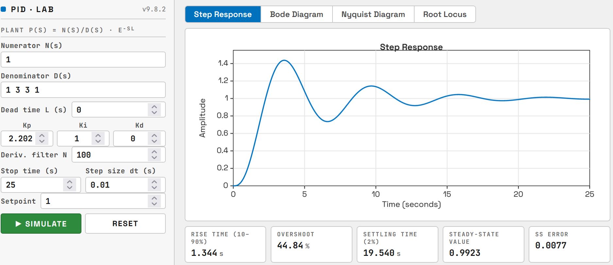

# PIDLab

A browser-based playground for PID controller design and analysis. Step Response, Bode Diagram, Nyquist Diagram and Root Locus, all in a single HTML file, no install required.

## Try it

Online: https://senolgulgonul.github.io/pidlab/

Offline: download `index.html` and double-click it. Works in any modern browser; nothing is sent to a server.

## What it does

PIDLab lets you specify a SISO plant `P(s) = N(s)/D(s) · e^(-sL)` and a parallel-form PID controller

C(s) = Kp + Ki/s + Kd · N · s / (s + N)

and visualize the closed-loop behavior four ways:

- **Step Response**: time-domain simulation (RK4 with internal sub-stepping) with rise time, overshoot, settling time, steady-state value and steady-state error. The settling-time box turns red if the response has not entered the 2% band before the stop time, since the other metrics are then computed from an unsettled response.
- **Bode Diagram**: open-loop magnitude and phase with gain margin, phase margin and the crossover frequencies ω_cg (−180°) and ω_cp (0 dB), following MATLAB's `margin()` naming. The closed-loop stability flag is exact: from the closed-loop poles when L = 0, and from the Nyquist criterion (argument principle on the full D-contour) when L > 0.
- **Nyquist Diagram**: the L(jω) curve for ω > 0 with the critical point, the 1/Ms circle, and the gain and phase margins drawn where they live: a green segment from the −180° crossing to −1 (GM) and a red arc on the unit circle from −180° to the 0 dB crossing (PM), in the same colours as the crossover lines on the Bode plot. Also Ms, Mt and the encirclement count of (−1, 0).
- **Root Locus**: closed-loop pole-zero map of `T(s) = CP/(1+CP)` with three root loci, one per gain. With the other two gains held fixed the characteristic polynomial is linear in the swept gain, so each trace is a true Evans root locus in Kp, Ki or Kd from 0 to infinity. A gain that is currently 0 is swept too, so you see where the poles go when that term is switched on.

The Root Locus traces are the distinctive feature: at a glance you see which gain has leverage on which pole, and in which direction. You can also drag a closed-loop pole: grab a red square and pull it, the nearest trace locks (the others fade) and the pole slides along that locus while the corresponding gain and all four views update live. Only that one gain changes during a drag, exactly like dragging a pole in MATLAB's Control System Designer, but for each PID term separately.

## How to use

The left panel sets the plant and controller:

- **Numerator N(s)** and **Denominator D(s)**: polynomial coefficients in descending order, space-separated. Example: `1 3 3 1` means `s³ + 3s² + 3s + 1`.
- **Dead time L**: pure delay in seconds. Set to 0 to enable Root Locus (rational analysis only).
- **Kp / Ki / Kd**: controller gains in parallel form. Set a gain to 0 for P, PI, PD and so on.
- **Deriv. filter N**: first-order filter cutoff applied to the derivative term. Typical 10 to 100. Larger N means closer to an ideal derivative but adds a fast closed-loop pole at −N.
- **Stop time / Step size dt**: simulation horizon and output sample interval (the integrator sub-steps internally so that the derivative filter pole is resolved).
- **Setpoint**: reference value for the step response.

Hit `Simulate` (or Enter in any field) to update all views. In the Root Locus view, drag a pole to tune a gain graphically. In the Nyquist view, scroll to zoom, drag to pan, right-click to pin a frequency, double-click to reset.

The default example, `P(s) = 1/(s+1)³` with Kp = 2, Ki = 1, is a good starting point: try to reach a phase margin of 45° and a gain margin of 6 dB by adjusting Kp and Ki, and watch the Nyquist markers and the closed-loop poles move.

## Limitations

- SISO only
- Root Locus is disabled when dead time L > 0 (a Padé approximation would lie about the closed-loop poles, so the view disables itself)
- The Nyquist stability test assumes no open-loop poles on the imaginary axis other than at the origin; if there are, the stability flag shows "—"
- Plant orders above about 10 may show numerical noise in pole locations

## License

MIT

## Citation

If PIDLab is useful in published work, a citation to the related paper is appreciated:

Gülgönül, Ş. (2026). PIDLab: Offline PID parameter tuning and visualization tool (Version 1.0.0) GitHub. https://github.com/senolgulgonul/pidlab
